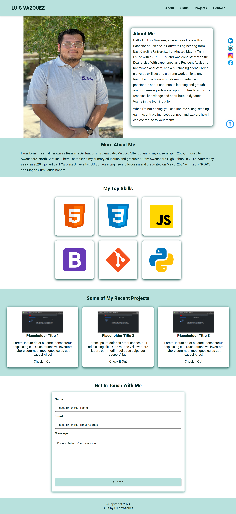

# Personal Website README



## Overview

This is the repository for my personal website built using HTML, CSS, and JavaScript. The website serves as a portfolio to showcase my skills, projects, and experience as a software engineer.

## Table of Contents

- [Features](#features)
- [Technologies Used](#technologies-used)
- [Setup and Installation](#setup-and-installation)
- [Usage](#usage)
- [Project Structure](#project-structure)
- [License](#license)

## Features

- **Responsive Design:** The website is designed to be fully responsive, adapting to various screen sizes and devices.
- **Animated Elements:** Utilizes CSS animations to enhance the user experience.
- **Interactive Navigation:** Smooth scrolling and a dynamic navigation menu.
- **Projects Showcase:** Highlights recent projects with detailed descriptions and links to live demos.
- **Contact Form:** Allows visitors to get in touch via a contact form integrated with Formspree.

## Technologies Used

- **HTML5**
- **CSS3**
  - Custom CSS
  - Animate.css for animations
- **JavaScript**
  - Ionicons for icons
- **External Libraries**
  - Formspree for contact form handling

## Setup and Installation

To set up this project locally, follow these steps:

1. **Clone the repository:**
   ```bash
   git clone https://github.com/LuisGVazquez/PersonalWebsite.git
2. **Navigate to the project directory:**
   ```bash
   cd PersonalWebsite   
3. **Open the index.html file in your preferred web browser:**
   ```bash
   open index.html

## Usage

Once the project is set up, you can customize it to fit your personal preferences:

**Update Personal Information:**  
Modify the content in the `index.html` file to reflect your personal information, skills, and project details.

**Customize Styles:**  
Edit the CSS in `assets/css/styles.css` to change the look and feel of the website.

**Add/Update Projects:**  
Add new project cards or update existing ones in the `projects` section of the `index.html` file.

## Project Structure

```plaintext
.
├── assets
│   ├── css
│   │   └── styles.css
│   ├── icons
│   │   ├── favicon_io
│   │   │   ├── favicon-32x32.png
│   │   │   └── ...
│   │   └── icons8-html5.svg
│   │   └── ...
│   ├── images
│   │   ├── luis.jpg
│   │   ├── placeholder.png
│   │   └── screenshot.png
│   └── js
│       └── app.js
├── index.html
└── README.md
```
## License
This project is licensed under the MIT License. See the LICENSE file for details.